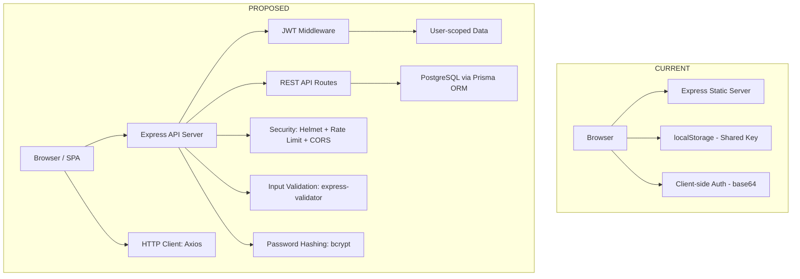
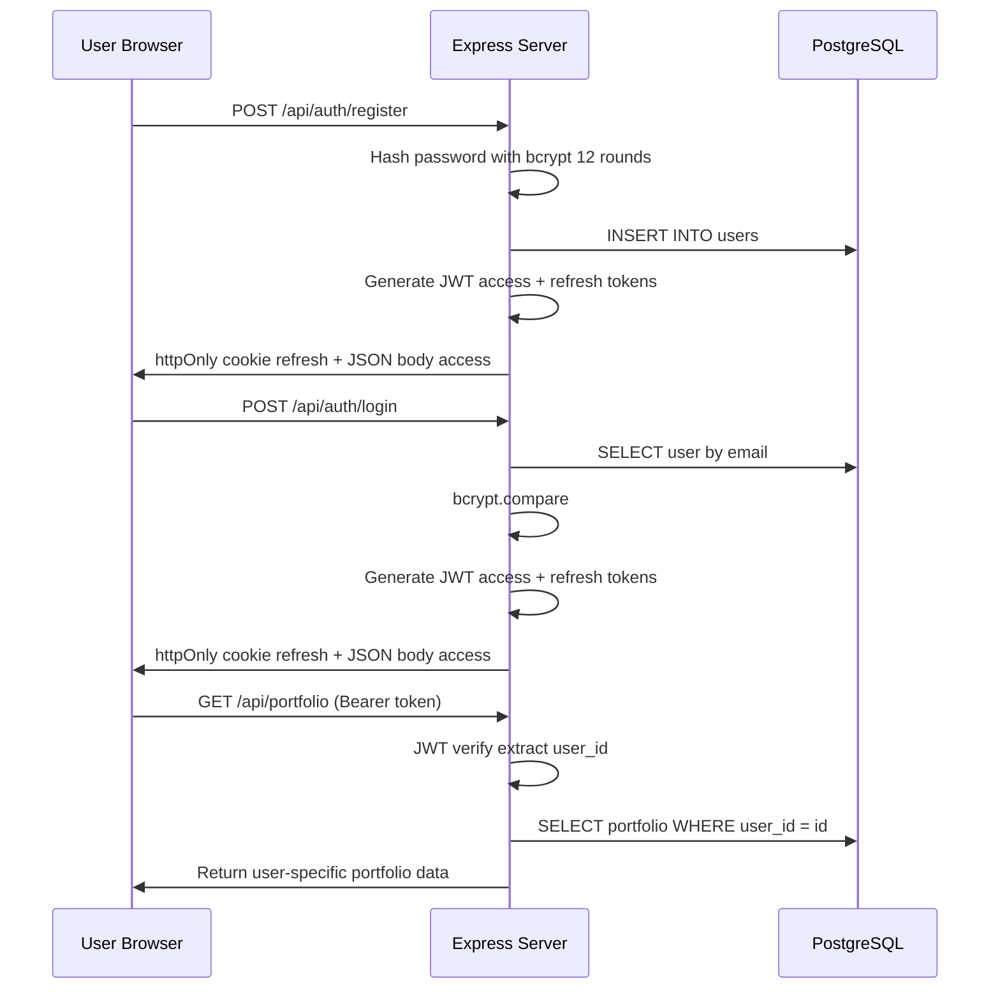

# Portfolio Management System — Full-Stack Upgrade Plan (PostgreSQL)

## Architecture: Current vs. Proposed



## Auth Flow



---

## Database Schema (PostgreSQL)

### Users Table
| Column | Type | Constraints |
|--------|------|-------------|
| id | SERIAL | PRIMARY KEY |
| username | VARCHAR(100) | UNIQUE, NOT NULL |
| email | VARCHAR(255) | UNIQUE, NOT NULL, INDEXED |
| password_hash | VARCHAR(255) | NOT NULL |
| avatar_preset | VARCHAR(50) | DEFAULT 'default' |
| avatar_config | JSONB | DEFAULT '{}' |
| created_at | TIMESTAMPTZ | DEFAULT NOW() |
| last_login | TIMESTAMPTZ | |
| refresh_token | TEXT | |

### Portfolios Table
| Column | Type | Constraints |
|--------|------|-------------|
| id | SERIAL | PRIMARY KEY |
| user_id | INTEGER | FK users(id) ON DELETE CASCADE, UNIQUE |
| name | VARCHAR(200) | NOT NULL |
| cash_balance | DECIMAL(15,2) | DEFAULT 100000.00 |
| created_at | TIMESTAMPTZ | DEFAULT NOW() |
| updated_at | TIMESTAMPTZ | DEFAULT NOW() |

### Assets Table
| Column | Type | Constraints |
|--------|------|-------------|
| id | SERIAL | PRIMARY KEY |
| portfolio_id | INTEGER | FK portfolios(id) ON DELETE CASCADE |
| name | VARCHAR(100) | NOT NULL |
| type | VARCHAR(50) | NOT NULL |
| current_price | DECIMAL(15,2) | NOT NULL |
| quantity | DECIMAL(15,6) | NOT NULL |
| average_cost | DECIMAL(15,2) | NOT NULL |
| total_invested | DECIMAL(15,2) | NOT NULL |
| created_at | TIMESTAMPTZ | DEFAULT NOW() |

### Transactions Table
| Column | Type | Constraints |
|--------|------|-------------|
| id | SERIAL | PRIMARY KEY |
| portfolio_id | INTEGER | FK portfolios(id) ON DELETE CASCADE |
| asset_name | VARCHAR(100) | NOT NULL |
| type | VARCHAR(20) | NOT NULL (buy/sell/dividend/interest) |
| amount | DECIMAL(15,2) | NOT NULL |
| price | DECIMAL(15,2) | |
| quantity | DECIMAL(15,6) | |
| status | VARCHAR(20) | DEFAULT 'completed' |
| date | DATE | NOT NULL |
| created_at | TIMESTAMPTZ | DEFAULT NOW() |

---

## API Endpoints

| Endpoint | Method | Auth | Purpose |
|----------|--------|------|---------|
| `/api/auth/register` | POST | No | Register new user |
| `/api/auth/login` | POST | No | Login, get tokens |
| `/api/auth/refresh` | POST | Refresh | Get new access token |
| `/api/auth/logout` | POST | Yes | Invalidate refresh token |
| `/api/portfolio` | GET | Yes | Get user's portfolio |
| `/api/portfolio/transactions` | GET | Yes | Get user's transactions |
| `/api/portfolio/transactions` | POST | Yes | Add transaction |
| `/api/portfolio/transactions/:id` | DELETE | Yes | Delete transaction |
| `/api/portfolio/export` | GET | Yes | Export portfolio as JSON/CSV |
| `/api/profile` | GET | Yes | Get user profile |
| `/api/profile` | PUT | Yes | Update user profile |
| `/api/health` | GET | No | Server health check |

---

## Technology Stack

### Backend
- Express.js — Web framework
- Prisma ORM — Database ORM for PostgreSQL
- bcrypt — Password hashing
- jsonwebtoken — JWT token generation/verification
- cookie-parser — HTTP-only cookie handling
- helmet — Security headers
- express-rate-limit — Rate limiting
- cors — Cross-origin resource sharing
- express-validator — Input validation
- morgan — Request logging
- dotenv — Environment variables

### Frontend
- Axios — HTTP client with interceptors
- Chart.js — Portfolio visualization (existing)
- Toastify-js — Notifications (replaces alert())

### Dev Tools
- nodemon — Auto-restart server
- prisma — Database migrations
- jest + supertest — Testing
- eslint + prettier — Code quality

---

## Execution Order

### Step 1: Directory Structure & Dependencies
Create server/ directory tree, install all npm packages.

### Step 2: Environment & Config
Create .env, .env.example, .gitignore, Prisma schema, DB config.

### Step 3: Utilities & Middleware
JWT helpers, ApiError class, auth middleware, error handler, validate middleware.

### Step 4: Controllers
Auth controller, portfolio controller, profile controller.

### Step 5: Routes
Auth routes, portfolio routes, profile routes.

### Step 6: Main Server (app.js)
Wire up Express with all middleware, routes, and Prisma.

### Step 7: Frontend API Modules
authApi.js, portfolioApi.js with Axios interceptors.

### Step 8: Update Frontend JS
Rewrite auth.js, data-models.js, script.js for API-based operations.

### Step 9: Update HTML Pages
Remove inline scripts, add proper module references, update forms.

### Step 10: Documentation & Polish
Swagger, README, ESLint, Prettier, Docker, .gitignore.

---

## File Structure (Proposed)

```
portfolio-management-system/
├── server/
│   ├── config/
│   │   └── db.js
│   ├── middleware/
│   │   ├── auth.js
│   │   ├── errorHandler.js
│   │   └── validate.js
│   ├── controllers/
│   │   ├── authController.js
│   │   ├── portfolioController.js
│   │   └── profileController.js
│   ├── routes/
│   │   ├── auth.js
│   │   ├── portfolio.js
│   │   └── profile.js
│   ├── utils/
│   │   ├── jwt.js
│   │   └── ApiError.js
│   └── app.js
├── prisma/
│   └── schema.prisma
├── public/
│   ├── css/
│   │   └── styles.css
│   ├── js/
│   │   ├── api/
│   │   │   ├── authApi.js
│   │   │   └── portfolioApi.js
│   │   ├── models/
│   │   │   └── data-models.js
│   │   ├── ui/
│   │   │   ├── portfolio.js
│   │   │   ├── transactions.js
│   │   │   ├── reports.js
│   │   │   └── profile.js
│   │   ├── auth.js
│   │   └── app.js
│   ├── index.html
│   ├── portfolio.html
│   ├── transactions.html
│   ├── reports.html
│   ├── profile.html
│   ├── login.html
│   └── signup.html
├── tests/
│   ├── auth.test.js
│   └── portfolio.test.js
├── .env.example
├── .eslintrc.js
├── .prettierrc
├── .gitignore
├── docker-compose.yml
├── Dockerfile
├── package.json
├── server.js
└── README.md
```
